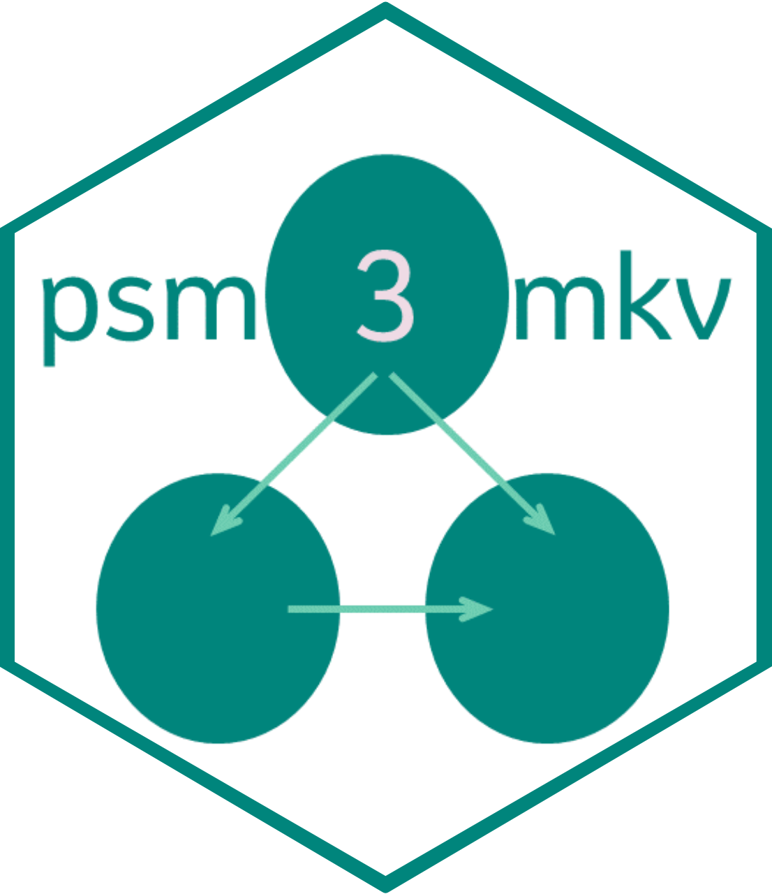

<!-- README.md is generated from README.Rmd. Please edit that file -->

# psm3mkv: A package to evaluate the fit and efficiency of three state oncology cost-effectiveness model structures 

  <!-- badges: start -->
  [](https://github.com/merck-gen/bards-baamr-psm3mkv/actions/workflows/R-CMD-check.yaml)
  [](https://app.codecov.io/gh/merck-gen/bards-baamr-psm3mkv?branch=main)
  <!-- badges: end -->

The goal of *psm3mkv* is to evaluate the efficiency and fit of certain three state model structures to data typical from an oncology clinical trial. The package evaluates the following structures:

* Partitioned Survival Model/analysis (PSM),

* Clock-forward State Transition Model (STM-CF), and

* Clock-reset State Transition Model (STM-CR).

The state transition models differ from each other in that the transition from progressive disease to death is a function of time from baseline in the STM-CF and time from progression in the STM-CR.[1,2]

The package requires a patient-level dataset of time to progression (TTP), progression-free survival (PFS) and overall survival (OS).

Given this, the package enables:

* Fitting a range of models to endpoints relevant each model type:
    + One piece parametric (distributions according to [flexsurv](https://cran.r-project.org/web/packages/flexsurv/index.html)).
    
    + Royston-Parmar splines (1-3 internal knots, hazard/odds/normal scales, again as per [flexsurv](https://cran.r-project.org/web/packages/flexsurv/index.html))[3].
    
    + Two piece parametric (given a time cutoff).

* Selecting the 'best fit' survival models for each endpoint (using the Akaike Information Criterion, Bayesian Information Criterion or other user preference).

* Deriving and presenting likelihoods for the 3 structures so as to evaluate fit.

* Presenting the total number of parameters used for each structure, to additionally evaluate efficiency.

* Deriving and presenting restricted mean durations by health state and for each of the 3 model structures (given a time horizon), to evaluate plausibility and structural sensitivity.
    + Bootstrap standard errors can be derived.

* Graphically illustrate observed and fitted membership probabilities, to allow visual inspection of fit of the 3 model structures.

Where two piece modeling is used, modelers should be advised to take care of interpretation and validity in case different cutoff points are selected for different endpoints.

Additionally, for parametric modeling of STM structures, the model for survival in the progressive disease state (post progression survival, PPS) may be a function of an additional arbitrary explanatory variable. This is intended to enable the exploration of TTP (or some transformation) as a predictor for PPS.

## Vignettes

The accompanying `vignette("example")` illustrates how the package can be used for the one-piece parametric and spline modeling.

A second vignette is in development to illustrate the use of this package for the modeling of PPS in relation to explanatory variables such as TTP.

## Installation

The package requires version 4.1 of R. This is due to use of the [native pipe](https://www.r-bloggers.com/2021/05/the-new-r-pipe/) brought in with this version in April 2021. Please ensure R is updated first.

The development version of *psm3mkv* may be downloaded as follows:

``` r
# Install from Github as follows (with the vignette)
remotes::install_github("Merck/psm3mkv", build_vignettes=TRUE)
```

## Licensing

Copyright (c) 2023 Merck & Co., Inc., Rahway, NJ, USA and its affiliates.
All rights reserved.

This file is part of the psm3mkv program.

psm3mkv is free software: you can redistribute it and/or modify it under the terms of the GNU General Public License as published by the Free Software Foundation, either version 3 of the License, or (at your option) any later version.

This program is distributed in the hope that it will be useful, but WITHOUT ANY WARRANTY; without even the implied warranty of MERCHANTABILITY or FITNESS FOR A PARTICULAR PURPOSE. See the GNU General Public License for more details.

You should have received a copy of the GNU General Public License along with this program. If not, see <http://www.gnu.org/licenses/>.

psm3mkv uses third-party R packages which may be distributed under different
licenses.

## References

1. Jackson C, Metcalfe P, Amdahl J, Warkentin MT, Sweeting M, Kunzmann K. flexsurv: Flexible Parametric Survival and Multi-State Models. Available at: https://cran.r-project.org/web/packages/flexsurv/index.html.

2. Woods BS, Sideris E, Palmer S, Latimer N, Soares M. Partitioned Survival and State Transition Models for Healthcare Decision Making in Oncology: Where Are We Now? Value in Health 23(12):1613-21; 2020. [DOI: 10.1016/j.jval.2020.08.2094](https://doi.org/10.1016/j.jval.2020.08.2094)

3. Royston P and Parmar M. Flexible parametric proportional-hazards and proportional-odds models for censored survival data, with application to prognostic modelling and estimation of treatment effects. Statistics in Medicine 21(1):2175-2197; 2002. [DOI: 10.1002/sim.1203](https://doi.org/10.1002/sim.1203)
